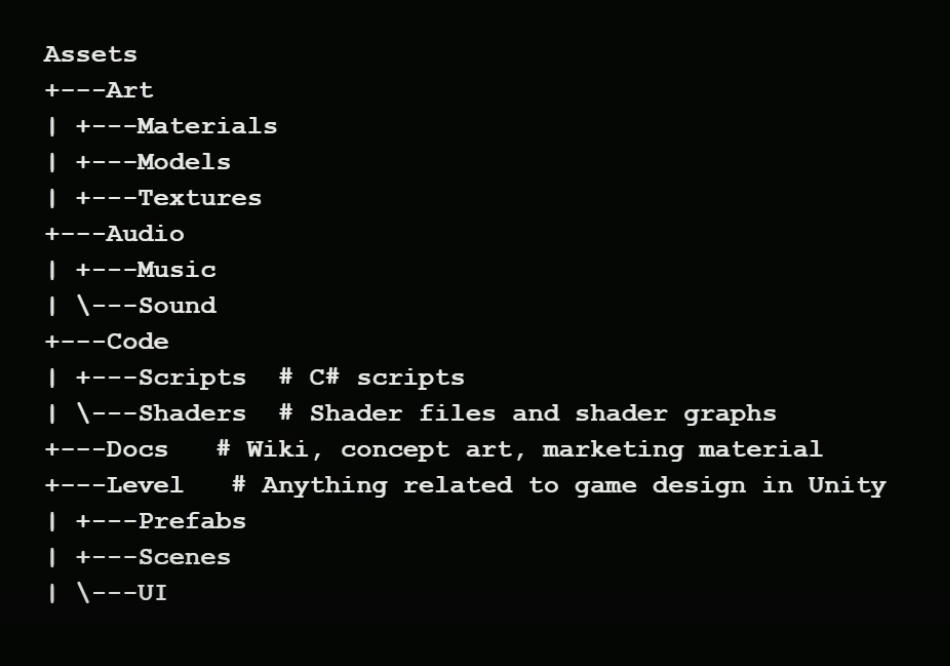
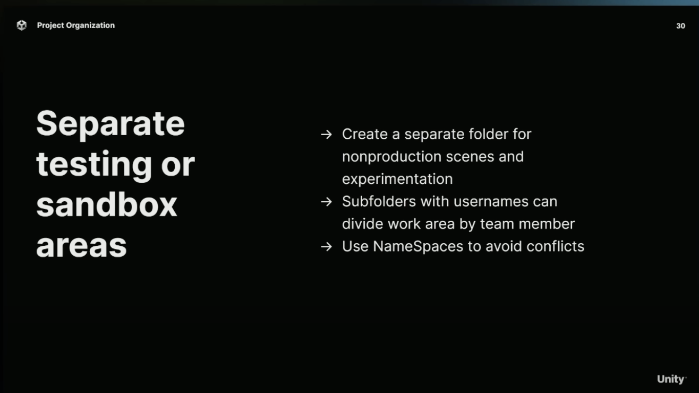
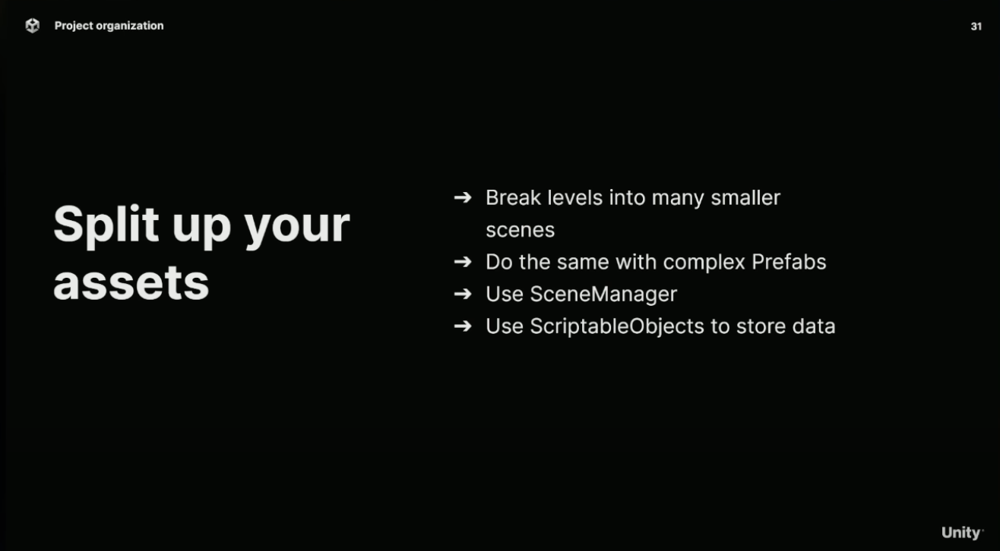
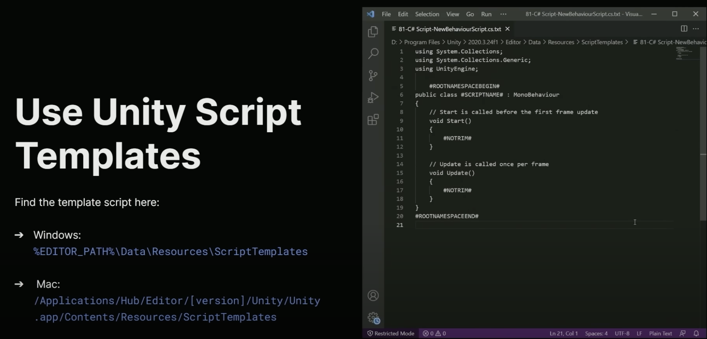

# Quickstart

:warning: No process is perfect.

## Architecture
### 1. Controllers (C# = "The What")
Manages <u style="color: magenta;">implementation detail</u> of the logic and communicating with other GameObjects.
```cs
// Reference to GameManager
private GameManager _gameManager = GameManager.Instance;

// Controller variables are always private
[SerializeField] private float _speed;
[SerializeField] private float _health;
[SerializeField] private float _damage;

// Getters are used to access the variables from a PlayMaker FSM
// Getters are written on one line
public float GetSpeed(){ return _speed; } // Gets speed
public float GetHealth(){ return _health; } // Gets health
public float GetDamage(){ return _damage; } // Gets damage
// ...

// --------------------------
// LIFECYCLE
// --------------------------
private void Start() {
 // ...
}
private void FixedUpdate() {
 // ...
}
private void Update() {
 // ...
}
private void OnTriggerEnter(Collider other) {
   if (other.gameObject.CompareTag("enemy")) {
       other.getComponent<EnemyController>().GetPower();
       TakeDamage()
   }
}

// --------------------------
// METHODS (Event Callbacks)
// --------------------------
public void TakeDamage() {
  _gameManager.OnPlayerTakeDamage?.Invoke();
  // Do stuff...
  On
}

```

### 2. FSMs (PlayMaker = "The When")
```cs
// PlayMaker variables are local variables used as duplicates of the variables in the Controller
var FSM_PLAYER_SPEED // Value is stored in this variable when Player.GetSpeed() is Invoked
var FSM_PLAYER_DAMAGE // Value is stored in this variable when Player.GetDamage() is Invoked
var FSM_PLAYER_HEALTH // Value is stored in this variable when Player.GetHealth() is Invoked
```


## General tips





## WIP Assets
+ https://www.spriters-resource.com

## Toolchain


## Mechanics
BossAI.cs
+ [Tutorial](https://www.youtube.com/watch?v=X7VwAGvAOIw)
```cs

```

SpawnEffect.cs
```cs

```

LifeBar.cs
```cs

```

Shoot.cs
```cs

```

TakeDamage.cs
```cs

```

ToggleInventoryScreen.cs
```cs

```
